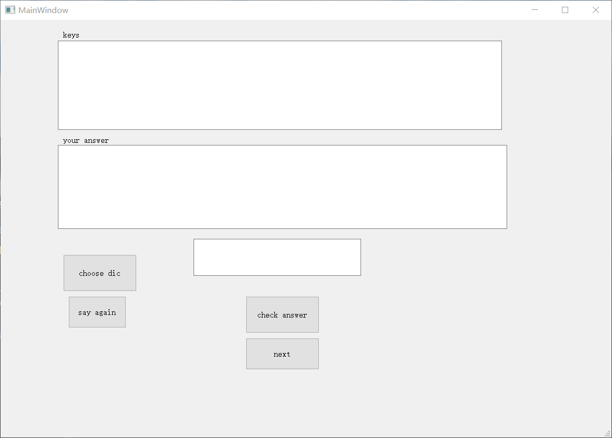

## introduction
This little interface intends to improve the spelling correction when doing IELTS computer base test, cause it is totally different when you using a keyboard to enter words instead of using a pen to write them on papers.
## installation
The interface is based on PyQt5, one may need to install anaconda with python 3 to include the PyQt5 package. The `win32com` package may also need to be installed separately to include the sound function. The interface can be started from spyder, or from cmd.
## user guide
### the words list

    
  
  

           
the interfece

The words which will be included in the training will be set by yourself in a txt format, stored in files named "valib". Examples have been included, you can also find some IELTS words list on the internet, but you may need to change them to txt format, or improve the reading file function in my code.

### the interface
You can import the words list by the button named `choose dic`. Then you can enter your answer based on what you have heard. Pushing `say again` to repeat. Using `check answer`, or using the shortcut `ctrl` on your keyboard, to check your spelling. If your spelling is correct, then it will show and say "correct" and then move to next words, without the need of clicking the textedit `your answer`. If your spelling is wrong, the correct answer will be shown in textedit named `keys`. You need to push `next` on the interface or shortcut `alt` on your keyboard, to continue. 
The words you have spell right will not be shown again, while the words you have spell wrong will repeat after a cycle, until you finish all the words with the correct answers.
